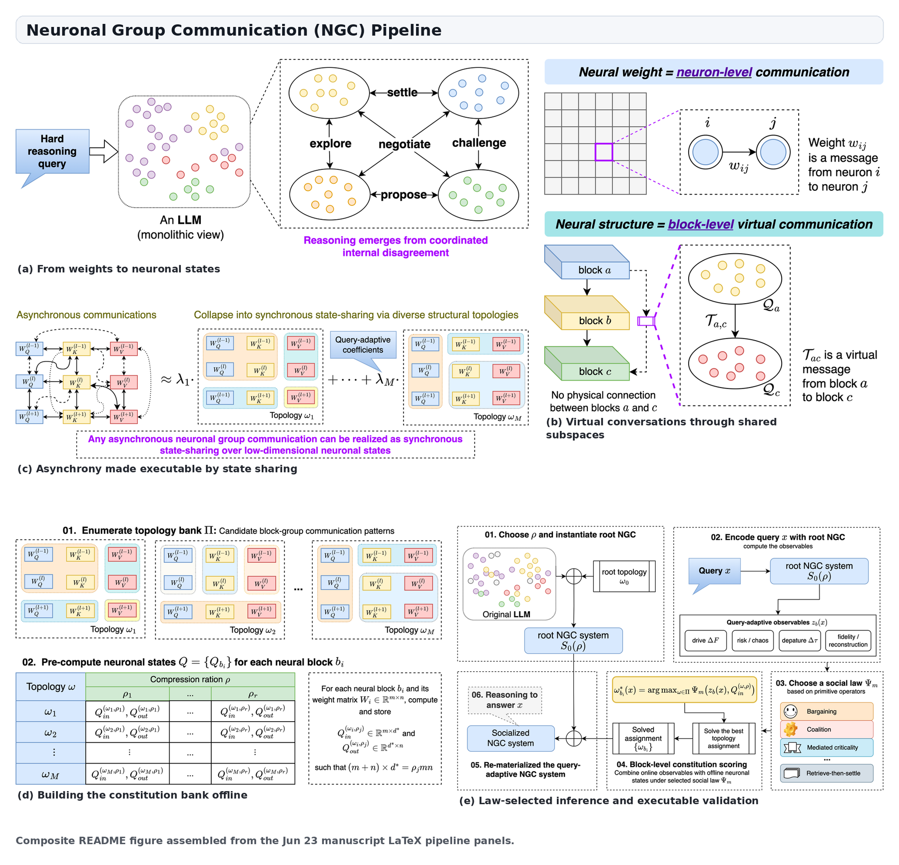

<div align="center">

# Neuronal Group Communication

### A Society of Neuronal Groups inside Large Language Models

**Method-level reproducibility package for NGC, negotiated stability, social-law topology selection, and query-adaptive routing in compressed LLMs.**


</div>

---

## Overview

**Neuronal Group Communication (NGC)** reinterprets a large language model not as a monolithic stack of static weight matrices, but as a **society of interacting neuronal groups**. Each internal neural block is rewritten as a group of neurons represented by low-dimensional latent states. Communication topologies, or **constitutions**, specify which groups share latent state subspaces and therefore which internal communities are allowed to coordinate.

The central empirical and mechanistic claim is **negotiated stability**: successful reasoning emerges when internal communities can depart from the root model's routine trajectory while those departures remain bounded, verifiable, and globally stable. In the manuscript, compression is used as an experimental microscope: under a severe parameter budget, the model must reveal which communication structures are worth preserving.

This repository contains the sanitized core code and representative data needed to audit the main evidence threads:

- low-rank/shared-neuron materialization of NGC blocks;
- construction and scoring of communication constitutions;
- social-law analyses over proposer, skeptic, stabilizer, mediator, retrieval, and settlement roles;
- cached baseline comparisons and adaptive-router experiments;
- representative figures, tables, and source data supporting the manuscript.


---

## Pipeline

<p align="center">
  
</p>

NGC proceeds in five stages:

1. **Rewrite neural blocks as neuronal groups.** Dense weight matrices are represented through low-dimensional input/output neuronal states.
2. **Open virtual communication channels.** Groups may communicate through shared latent subspaces even when they are not adjacent in the original Transformer graph.
3. **Construct a constitution bank.** Candidate communication topologies are enumerated and materialized under a compression budget.
4. **Score constitutions with social laws.** Query-conditioned observables measure departure, stability, reconstruction fidelity, transport balance, spectral behavior, and cost.
5. **Select and validate.** Fixed or learned selectors choose a topology for inference; cached and executable audits quantify accuracy, cost, and mechanistic behavior.

---

## Core idea

For a neural block \(b\) with dense weight matrix

$$
W_b \in \mathbb{R}^{m_b \times n_b},
$$

NGC represents the block using low-dimensional neuronal state matrices

$$
Q_{b,\mathrm{in}} \in \mathbb{R}^{n_b \times r_b}, \qquad
Q_{b,\mathrm{out}} \in \mathbb{R}^{m_b \times r_b}, \qquad r_b \ll \min(m_b,n_b).
$$

The reconstructed communication strength is

$$
\widehat W_b[j,i] = \mu\left(Q_{b,\mathrm{out}}[j], Q_{b,\mathrm{in}}[i]\right),
$$

where the minimal implementation uses the bilinear rule \(\mu(u,v)=u^\top v\). Under this view, a weight entry is no longer an isolated scalar parameter; it is a relation induced by the states of two neurons. Inter-group communication is implemented by aligning or sharing latent subspaces across blocks.

---

---

## Research lineage

NGC is part of a continuing research program on replacing static, weight-centric neural computation with **state-based, dynamics-aware, and geometry-aware neural representations**. The current repository extends three prior works from our group: from dynamical neuron-state modeling, to Riemannian neural representation compression, and finally to neuronal-group communication inside LLMs.

| Year | Work | Venue | Connection to NGC |
|---:|---|---|---|
| 2023 | [Dynamics-inspired Neuromorphic Visual Representation Learning](https://proceedings.mlr.press/v202/pei23b.html) | **ICML 2023 Oral** | Introduces the dynamics-inspired view that neural computation can be reformulated through interactions among dynamical neuron or sub-model states rather than conventional standalone weight entries. This provides the conceptual basis for treating weights as induced relations between latent neuronal states. |
| 2024 | [Data-free Neural Representation Compression with Riemannian Neural Dynamics](https://proceedings.mlr.press/v235/pei24d.html) | **ICML 2024 Oral** | Develops Riemannian neuronal state spaces and metric-based neural interactions for parameter-efficient representation. This motivates the NGC view that compact neuronal-state geometry can preserve computation more faithfully than naive matrix truncation. |
| 2025 | [Neuronal Group Communication for Efficient Neural Representation](https://arxiv.org/abs/2510.16851) | **arXiv preprint** | Generalizes the earlier neuron-state and Riemannian-dynamics perspectives to interacting neuronal groups. This preprint introduces the NGC framework, including intra-group and inter-group communication, virtual communication through shared latent subspaces, and stability-oriented analysis of reasoning. |

Together, these works establish the intellectual trajectory behind this repository:

1. **Dynamics-inspired neural representation**: neural weights can be interpreted as relations induced by latent dynamical states.
2. **Riemannian neuronal geometry**: neural interaction can be modeled more efficiently through structured neuronal state spaces and learned metrics.
3. **Neuronal Group Communication**: LLM reasoning can be studied as the coordinated behavior of interacting neuronal groups under query-adaptive communication constitutions.

In this sense, the current NGC artifact is not only a compression toolkit. It is a research platform for investigating how efficient representation, dynamical stability, modular neural organization, and mechanistic interpretability can be unified under a communication-based view of large language models.


## Manuscript result snapshot

The following numbers are copied from the Jun 23 manuscript draft and are included here only as a high-level orientation. Accuracy is reported in percent. The full manuscript tables also report mean generated tokens in parentheses.

### 90% parameter compression: mathematical reasoning

| Model | GSM8K | MATH500 | AIME | AIME, thinking mode |
|---|---:|---:|---:|---:|
| LLaMA3-8B, Original → NGC | 82.5 → **84.5** | 64.0 → **68.4** | 5.7 → **8.9** | / |
| Qwen3-4B, Original → NGC | 90.9 → **90.9** | 84.8 → **87.2** | 21.8 → **22.6** | 72.5 → **76.2** |
| Qwen3-8B, Original → NGC | 92.1 → **93.4** | 87.3 → **89.2** | 19.8 → **22.6** | 77.4 → **79.4** |
| Qwen3-32B, Original → NGC | 94.1 → **95.9** | 89.6 → **92.8** | 24.5 → **27.8** | 83.3 → **86.2** |

### 90% parameter compression: knowledge-intensive reasoning

| Model | MMLU-Pro | GPQA | Science-QA | Hotpot-QA |
|---|---:|---:|---:|---:|
| LLaMA3-8B, Original → NGC | 41.9 → **48.7** | 32.7 → **36.6** | 74.4 → **79.7** | 60.1 → **65.4** |
| Qwen3-4B, Original → NGC | 58.7 → **60.2** | 45.9 → **46.9** | 74.4 → **76.3** | 56.2 → **61.5** |
| Qwen3-8B, Original → NGC | 61.2 → **63.4** | 49.8 → **52.3** | 76.7 → **79.9** | 66.4 → **69.8** |
| Qwen3-32B, Original → NGC | 65.2 → **68.7** | 61.4 → **65.9** | 83.1 → **86.5** | 73.1 → **76.9** |

### Social-law selection examples

| Model | Benchmark | Selected constitution | Raw | NGC | Gain |
|---|---|---|---:|---:|---:|
| Qwen3-8B | GPQA | Balanced argumentative settlement | 70.09 | **76.78** | +6.69 |
| Qwen3-8B | Hotpot-QA | Agreement-seeking bargaining | 80.00 | **87.33** | +7.33 |
| LLaMA3-8B | MATH500 | Adaptive debate with verifier fallback | 80.67 | **90.67** | +10.00 |
| LLaMA3-8B | AIME | Guarded homeostatic exploration | 22.55 | **43.14** | +20.59 |
| LLaMA3-8B | Hotpot-QA | Drive gated by dissipation | 73.33 | **90.67** | +17.34 |

These snapshots are meant to orient readers. For reproducibility, use the scripts and source data described below rather than manually copying values from the README.

---

## Repository layout

```text
.
├── ngc_core/
│   └── nsys_utils/                 # Core shared-neuron / low-rank materialization utilities
├── v1/
│   ├── src/ngc_v1/                 # Shared social-law analysis utilities
│   └── scripts/                    # Constitutional observables, social laws, controls, publication artifacts
├── v2/
│   └── scripts/                    # Feature bank, cached baselines, adaptive router, phase/cost/causal controls
├── examples/
│   ├── sample_input/               # Reduced query-complete candidate bank for smoke tests
│   ├── source_data/                # Representative source data for manuscript-facing tables/figures
│   ├── figures/                    # Representative manuscript-facing figures
│   └── tables/                     # LaTeX table snippets copied from final experiment outputs
├── docs/
│   ├── artifact_map.md             # Mapping between scripts and manuscript evidence
│   ├── reproducibility_scope.md    # What this package can and cannot reproduce
│   ├── sanitization_report.md      # Release sanitization notes
│   └── validation_report.md        # Local checks and smoke-workflow validation
├── requirements.txt
└── README.md
```

---

## Installation

The cached analysis workflow is intentionally lightweight and uses standard scientific Python packages.

```bash
git clone git@github.com:pzqpzq/NGC.git ngc
cd ngc

python -m venv .venv
source .venv/bin/activate
python -m pip install --upgrade pip
pip install -r requirements.txt
```

The minimal cached workflow uses `numpy`, `pandas`, `scikit-learn`, `matplotlib`, `seaborn`, `joblib`, `tqdm`, and `pyarrow`.

Live inference and NGC block materialization require user-managed model/runtime dependencies such as PyTorch, Transformers, CUDA-compatible drivers, and local model checkpoints. Those dependencies are not pinned in `requirements.txt` because the correct versions depend on the user's hardware and model family.

On some Linux conda environments, matplotlib may need the conda C++ runtime to appear before the system runtime:

```bash
export LD_LIBRARY_PATH="$CONDA_PREFIX/lib:${LD_LIBRARY_PATH:-}"
```

---

## Quick smoke test

The bundled candidate bank is a reduced, query-complete sample intended for fast repository validation. It contains:

- **16,748** candidate rows;
- **450** query groups;
- six model/dataset pairs: `qwen3-8b` and `llama3-8b` on `gpqa`, `hotpot-qa`, and `math500`;
- three topology families: `NGC`, `Basis Sharing`, and `Vanilla SVD`.

Run from the repository root:

```bash
mkdir -p outputs
cp -R examples/sample_input outputs/sample_run

python v2/scripts/02_run_baselines.py \
  --v2-root outputs/sample_run \
  --n-bootstrap 100

python v2/scripts/04_train_adaptive_router.py \
  --v2-root outputs/sample_run \
  --n-bootstrap 100

python v2/scripts/09_make_tables_and_figures.py \
  --v1-root v1 \
  --v2-root outputs/sample_run
```

For a very fast CI-style check, lower `--n-bootstrap` to `20`. For more stable confidence intervals, increase it to `1000` or above.

Expected outputs include:

```text
outputs/sample_run/results/baseline_compression_results.csv
outputs/sample_run/results/baseline_vs_ngc_bootstrap.csv
outputs/sample_run/results/router_holdout_results.csv
outputs/sample_run/results/table_insert_router_main.csv
outputs/sample_run/reports/final_experiment_digest_for_paper.md
outputs/sample_run/figures/baseline_accuracy_compression_curve.png
outputs/sample_run/figures/router_fixed_vs_adaptive_by_benchmark.png
outputs/sample_run/figures/router_oracle_gap.png
outputs/sample_run/figures/router_cost_accuracy_pareto.png
```

---

## Reproducibility levels

| Level | Goal | Required assets | Main entry points |
|---|---|---|---|
| **Level 1: smoke test** | Validate the cached pipeline on bundled sample data. | Included `examples/sample_input`. | `v2/scripts/02_run_baselines.py`, `04_train_adaptive_router.py`, `09_make_tables_and_figures.py` |
| **Level 2: cached paper-scale rerun** | Rebuild manuscript-facing tables/figures from local equivalents of the cached artifact roots. | User-provided `NGC_V0_ROOT`, `NGC_V1_ROOT`, `NGC_V2_ROOT` artifact trees. | `v1/scripts/*.py`, `v2/scripts/*.py` |
| **Level 3: live inference rerun** | Regenerate model outputs and executable audits. | Public model checkpoints, dataset paths, NGC checkpoint/topology artifacts, GPU runtime. | `v1/scripts/08_live_grid_runner.py`, `v1/scripts/11_controlled_overhead.py`, `v2/scripts/11_causal_role_perturbation.py`, `v2/scripts/12_end_to_end_cost_audit.py` |

Set artifact roots explicitly for cached or live reruns:

```bash
export NGC_V0_ROOT=/path/to/NGC-v0-like-artifacts
export NGC_V1_ROOT=$PWD/v1
export NGC_V2_ROOT=/path/to/output-root
```

---

## Main analysis scripts

### v1: social laws and negotiated stability

| Script | Purpose |
|---|---|
| `v1/scripts/01_build_constitutional_observables.py` | Build candidate observables and social-role features from cached candidate metrics. |
| `v1/scripts/02_social_law_atlas.py` | Summarize benchmark demand and role signatures across social laws. |
| `v1/scripts/03_train_constitutional_selector.py` | Evaluate fixed and learned selectors on grouped held-out queries. |
| `v1/scripts/04_matched_law_breaking_controls.py` | Test law-breaking controls against reconstruction-only explanations. |
| `v1/scripts/05_negotiated_stability_curve.py` | Build bounded-disagreement and negotiated-stability diagnostics. |
| `v1/scripts/06_role_knockout_cached.py` | Ablate evidence broker, mediator, settlement, veto, and reconstruction guard roles. |
| `v1/scripts/07_failure_taxonomy.py` | Summarize failure modes for fixed-law selected candidates. |
| `v1/scripts/08_live_grid_runner.py` | Aggregate or execute live validation runs. |
| `v1/scripts/11_controlled_overhead.py` | Summarize controlled inference overhead. |
| `v1/scripts/14_make_publication_artifacts.py` | Assemble final manuscript-facing figures, tables, source data, and reports. |

A cached v1-style sequence is:

```bash
python v1/scripts/01_build_constitutional_observables.py --v0-root "$NGC_V0_ROOT" --v1-root "$NGC_V1_ROOT"
python v1/scripts/02_social_law_atlas.py              --v0-root "$NGC_V0_ROOT" --v1-root "$NGC_V1_ROOT"
python v1/scripts/03_train_constitutional_selector.py --v0-root "$NGC_V0_ROOT" --v1-root "$NGC_V1_ROOT"
python v1/scripts/04_matched_law_breaking_controls.py --v0-root "$NGC_V0_ROOT" --v1-root "$NGC_V1_ROOT"
python v1/scripts/05_negotiated_stability_curve.py    --v0-root "$NGC_V0_ROOT" --v1-root "$NGC_V1_ROOT"
python v1/scripts/06_role_knockout_cached.py          --v0-root "$NGC_V0_ROOT" --v1-root "$NGC_V1_ROOT"
python v1/scripts/07_failure_taxonomy.py              --v0-root "$NGC_V0_ROOT" --v1-root "$NGC_V1_ROOT"
python v1/scripts/14_make_publication_artifacts.py    --v1-root "$NGC_V1_ROOT"
```

### v2: router, baselines, and mechanistic controls

| Script | Purpose |
|---|---|
| `v2/scripts/01_build_feature_bank.py` | Merge v1 observables with richer candidate-bank features. |
| `v2/scripts/02_run_baselines.py` | Compare cached raw, SVD, basis-sharing, NGC, and lite/proxy baselines. |
| `v2/scripts/04_train_adaptive_router.py` | Train and evaluate adaptive constitution selectors. |
| `v2/scripts/07_role_ablation.py` | Ablate router feature families and role signals. |
| `v2/scripts/09_make_tables_and_figures.py` | Produce manuscript-facing router/baseline figures and tables. |
| `v2/scripts/10_phase_diagram_negotiated_stability.py` | Build phase-space diagnostics for negotiated stability. |
| `v2/scripts/11_causal_role_perturbation.py` | Execute or aggregate broker/settlement role perturbation experiments. |
| `v2/scripts/12_end_to_end_cost_audit.py` | Audit wall-clock, memory, and routing/generation costs. |
| `v2/scripts/13_make_jun15_artifacts.py` | Assemble Jun15 mechanistic-control figures and tables. |

A cached v2-style sequence is:

```bash
python v2/scripts/01_build_feature_bank.py --v0-root "$NGC_V0_ROOT" --v1-root "$NGC_V1_ROOT" --v2-root "$NGC_V2_ROOT"
python v2/scripts/02_run_baselines.py      --v2-root "$NGC_V2_ROOT"
python v2/scripts/04_train_adaptive_router.py --v2-root "$NGC_V2_ROOT"
python v2/scripts/07_role_ablation.py      --v1-root "$NGC_V1_ROOT" --v2-root "$NGC_V2_ROOT"
python v2/scripts/09_make_tables_and_figures.py --v1-root "$NGC_V1_ROOT" --v2-root "$NGC_V2_ROOT"
python v2/scripts/10_phase_diagram_negotiated_stability.py --v2-root "$NGC_V2_ROOT"
python v2/scripts/13_make_jun15_artifacts.py --v2-root "$NGC_V2_ROOT"
```

---

## Core implementation modules

The `ngc_core/nsys_utils/` directory contains the implementation fragments that materialize NGC-style neural systems:

| Module | Role |
|---|---|
| `generate_ONT.py` | Generate topology families over attention and MLP block types. |
| `nsys_config.py` | Define shared-neuron low-rank modules such as `SharedNeuronsHybrid*` and `LinearFromSharedNSys`. |
| `capture_Acts.py` | Capture activation tensors from target MLP and attention projections. |
| `train_new.py` | Fit and evaluate neural-system reconstructions against activation and weight targets. |

Example imports:

```python
from ngc_core.nsys_utils.nsys_config import (
    SharedNeuronsHybrid2,
    SharedNeuronsHybrid3,
    LinearFromSharedNSys,
)
from ngc_core.nsys_utils.generate_ONT import generate_NeurTp
```

---

## Social laws in brief

| Law family | Operating principle | Interpretation |
|---|---|---|
| **Bargaining** | The weakest among proposal, skepticism, and stabilization limits the score. | Competing internal voices must all remain acceptable before commitment. |
| **Coalition** | Multiple utilities jointly endorse the same constitution. | Several internal factions support a topology instead of one channel dominating. |
| **Mediated criticality** | Departure is rewarded only in a stable intermediate band. | The system leaves routine trajectories without entering runaway instability. |
| **Retrieve-then-settle** | Early K/V blocks broker evidence; later Q/MLP blocks stabilize commitment. | Earlier communities expand evidence; later communities negotiate final settlement. |
| **Reconstruction-guarded exploration** | Proposal is allowed only under strict reconstruction and stability gates. | Exploration is tested against fidelity constraints. |
| **Settlement-only** | Late contraction is isolated from evidence-brokering behavior. | A negative/control-style law for testing whether settlement alone explains gains. |

These laws are executable scoring functions over query-conditioned block observables. The anthropomorphic names are operational labels, not claims that LLMs contain literal human-like agents.

---

## Baseline caveat

The cached scripts include exact comparisons for cached `Vanilla SVD`, `Basis Sharing`, and `NGC` candidates where corresponding candidates are present in the candidate bank. Some additional labels, such as `ASVD-lite`, `Dobi-SVD-lite`, `SVD-LLM-V2-lite`, and `SoLA-lite`, are **proxy/cached diagnostics** unless replaced by full upstream implementations. Keep these labels intact in derived reports unless you rerun the corresponding full methods.

---

## Included data and figures

Representative source data and manuscript-facing artifacts are provided under:

```text
examples/source_data/v1_social_laws/
examples/source_data/v2_router_baselines/
examples/source_data/jun15_mechanistic_controls/
examples/figures/v1_social_laws/
examples/figures/v2_router_baselines/
examples/figures/jun15_mechanistic_controls/
examples/tables/
```

The sample candidate bank schema is documented in:

```text
examples/sample_input/results/router_candidate_bank_schema.md
```

The package intentionally excludes:

- private server inventories, credentials, shell histories, and monitoring logs;
- model checkpoints, compressed checkpoints, and CUDA/model caches;
- full raw benchmark predictions and exhaustive candidate banks;
- private model/dataset loader files containing local filesystem paths;
- exploratory ablations not directly mapped to the manuscript's main claims.


---

## Citation

Please cite the manuscript if you use this code or the released artifacts. Until the final bibliographic entry is available, use:

```bibtex
@misc{pei2026ngc,
  title        = {A Society of Neuronal Groups inside Large Language Models},
  author       = {Pei, Zhengqi and Huang, Qingming and Wang, Shuhui},
  year         = {2026},
  note         = {Manuscript draft and method-level reproducibility package}
}
```

---

## Contact

**Academic collaboration**  
In collaboration with the **[Institute of Computing Technology, Chinese Academy of Sciences](https://english.ict.cas.cn/)**.  
Contact: [peizhengqi22@mails.ucas.ac.cn](mailto:peizhengqi22@mails.ucas.ac.cn)

**Business collaboration**  
In collaboration with **Beijing Chipflow Technology Co., Ltd.**. 
Contact: [peizhengqi@chipflow.net](mailto:peizhengqi@chipflow.net)

---
